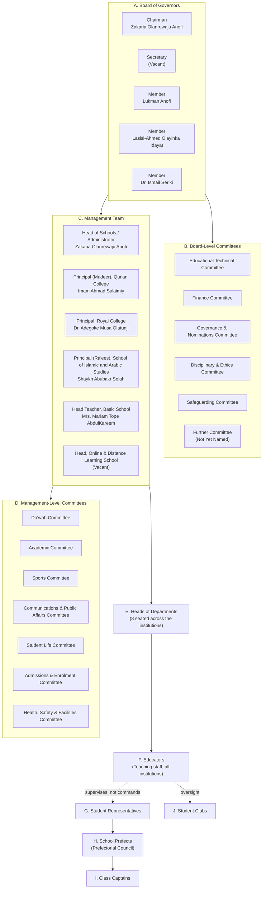
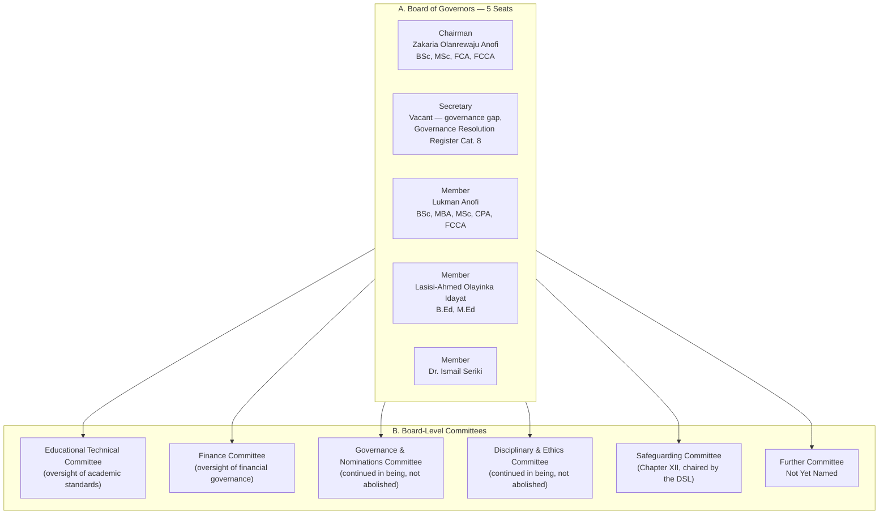
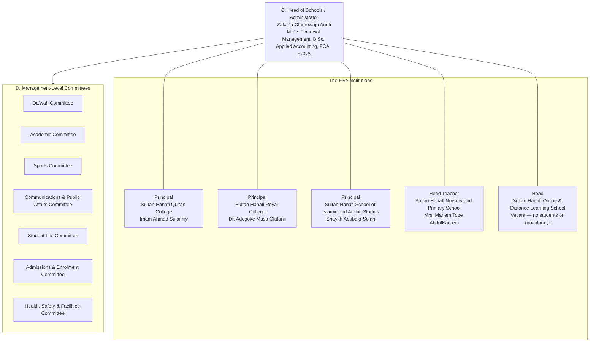
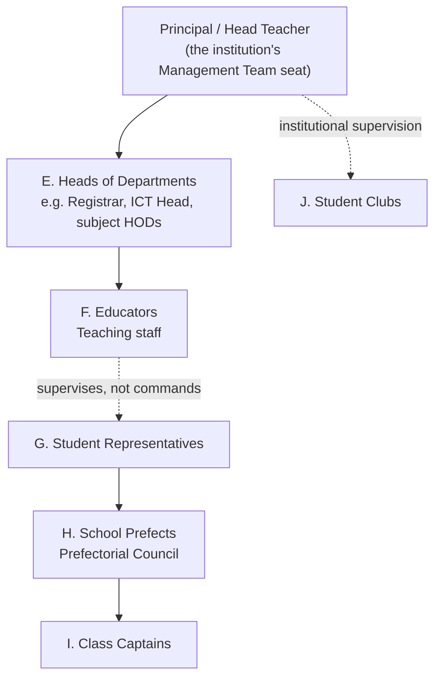

# Organisational Structure Manual

*A diagram-driven visual reference to the governance hierarchy the
Board's governance restructuring amendment of 2026-08-04 established.
This Manual illustrates structure; it does not create authority. Where
a diagram here and the Governance Charter appear to disagree, the
Charter governs and this Manual is wrong until corrected.*

## Document Information

| Field | Value |
|---|---|
| Document Title | Organisational Structure Manual |
| Document Type | Visual/structural reference (non-authoritative — see Purpose) |
| Version | 1.0 |
| Effective Date | Not applicable — this Manual does not itself take effect; it visualizes Policy GV-01 v3.0, effective per that document's own status |
| Document Owner | Board of Governors (content), maintained on the Board's behalf by the Head of Schools / Administrator |
| Approval Authority | Not separately approved — inherits GV-01's approval status; supersede this Manual by correcting it, not by approving it independently |
| Source Documents | Policy GV-01 — Constitution & Governance Charter (v3.0, 2026-08-04); the public Governance page (`pages/about-governance.html`); the Governance Resolution Register, Category 8; the live `offices` table model (`functions/api/portal/setup.js`) |
| Review Cycle | Same trigger as GV-01 Section 13 — immediately upon any material change to the Board's or Management Team's composition, and otherwise whenever GV-01 is reviewed |
| Next Review Date | Not yet set — tied to GV-01's own review |

## Version control

| Version | Date | Change | Author |
|---|---|---|---|
| 1.0 | 2026-08-04 | Initial publication, built from Policy GV-01 v3.0's A–J governance hierarchy, the public Governance page's real roster, and the Governance Resolution Register's Category 8 open items. No names or offices invented beyond what these three sources establish. | Drafted per SHRS documentation directive, alongside the parallel Governance Handbook and Board Handbook |

---

## 1. Purpose

This Manual exists to answer one question quickly and visually: **who
sits where, and who reports to whom.** The Governance Charter (Policy
GV-01) is the document that *establishes* the governance hierarchy
described here — its definitions, its delegation principles, its
procedures for amendment, vacancy, and escalation. This Manual does
not restate that reasoning; it draws the picture. Where the Governance
Handbook (`docs/governance-handbook.md`) explains governance in prose
and the Board Handbook (`docs/board-handbook.md`) explains how the
Board itself operates, this Manual's job is narrower and more visual:
one master org chart, three zoomed views for detail, a reporting-lines
table, and a tier-by-tier legend.

Every name, office, and vacancy shown below comes from Policy GV-01
v3.0, the live public Governance page, or the Governance Resolution
Register's Category 8 — nothing here is invented. Where a seat is
vacant (the Secretary to the Board; the Head of the Online & Distance
Learning School) or a body's membership has not yet been published
(the sixth, reserved Board-Level Committee; the Management-Level Committees'
membership), this Manual marks it as such rather than filling the gap
with a plausible-sounding name.

## 2. Master Org Chart — the full A–J hierarchy

The governance restructuring amendment defines ten tiers, lettered A
through J, running from the Board of Governors down to Student Clubs.
The chart below shows all ten in one view. Tiers A–C carry the real,
named roster as of 2026-08-04; tiers D–J are shown as structural
bands, since the Charter and the public Governance page establish
*that* these tiers exist and roughly what they contain, but do not
publish individual office-holders below the Heads of Departments.

**Reading this chart:** solid arrows are direct reporting/authority
lines (the Board appoints and holds the Management Team accountable;
the Management Team oversees the Heads of Departments). The dotted
arrow from Educators to Student Representatives marks a deliberately
different relationship — staff supervise and support student
governance, they do not command it the way a line manager commands a
subordinate. Tier C is drawn as one box because the Management Team
is a single collective body chaired by the Head of Schools /
Administrator, not a chain of command running through the Head to
each Principal individually.

## 3. Zoomed View (a) — Board of Governors and its Committees

The Board of Governors is five seats: a Chairman, a Secretary, and
three Other Members. The Secretary seat is a genuine governance gap,
not an oversight in this diagram — the Governance Resolution Register
tracks it as an open item under Category 8, created by the amendment
itself rather than inherited from before it. The Charter's Schedule of
Board Standing Committees (Article 97) fixes a minimum of five: the
Board has stood up five of its named Board-Level Committees to date
(Educational Technical Committee and Finance Committee, named directly
by the 2026-08-04 amendment; the Governance & Nominations Committee and
the Disciplinary & Ethics Committee, continued in being from before the
amendment; and the Safeguarding Committee, established under Chapter
XII). Membership and terms of reference for the Educational Technical
and Finance Committees, and the identity of the sixth, reserved
committee, remain unpublished as of this Manual's version.

## 4. Zoomed View (b) — Management Team, the Five Institutions, and Management-Level Committees

The Management Team is six seats: the Head of Schools / Administrator
(chairing) plus the Head of each of the five institutions. The
undirected lines between the Head of Schools / Administrator and the
five Principals/Head Teacher (`---` rather than `-->`) are deliberate
— they sit together as one collective body, not in a line-management
chain running through the Head to each Principal. The fifth
institution's headship is vacant by design, not omission: the Online
& Distance Learning School was newly recognised by the 2026-08-04
amendment and does not yet have students, a curriculum, or an
appointed Head. The Governance Charter fixes a minimum of seven
Management-Level standing committees — Da'wah, Academic, Sports,
Communications & Public Affairs, Student Life, Admissions & Enrolment,
and Health, Safety & Facilities. The Charter does not constitute a
separate Health and Safety Committee or Complaints Committee (Article
115): health and safety matters route through the Health, Safety &
Facilities Committee and, at institutional level, the Safeguarding
Committee; formal written complaints route through the Disciplinary &
Ethics Committee.

## 5. Zoomed View (c) — Single-Institution Internal Structure (Repeatable Pattern)

Each of the five institutions repeats the same internal pattern below
its Principal/Head Teacher seat. This is shown once, as a template,
rather than five times with the same shape — the only variation across
institutions is which Principal/Head Teacher sits at the top (Section
4) and how many Heads of Departments, educators, and students that
particular institution has, which this Manual does not have figures
for.

Below the Head of Department layer, this diagram deliberately mixes
solid and dotted lines. Solid lines (Head → HODs → Educators, and
Student Representatives → Prefects → Class Captains) are structural:
each sits inside the one above it in a real organisational sense.
Dotted lines (Educators to Student Representatives; the institution's
Head to Student Clubs) are supervisory rather than command
relationships — student governance bodies and clubs are recognised
and supported by staff, not directed by them the way a department
runs. No named office-holders exist yet in the source documents for
tiers E (below the eight HODs already seated), F, G, H, I, or J at
individual-institution granularity; this pattern is the shape those
appointments will fill, not a claim that they are filled today.

## 6. Reporting-Lines Table

| From (tier) | Reports / accountable to | Relationship | Notes |
|---|---|---|---|
| A. Board of Governors | Constitution & Governance Charter itself (self-governing at the apex) | — | Amends its own Charter only per Article 151 (30 days' notice, two-thirds of Governors present and voting, and — for Chapter II amendments — the Founder's written consent) and, for Article 8, the four-fifths threshold of Article 157 |
| B. Board-Level Committees | A. Board of Governors | Solid — delegated standing authority | Exercise Board-level oversight on the Board's behalf; do not report through Management |
| C. Management Team | A. Board of Governors | Solid — appointed and held accountable | Board appoints and holds accountable the Head of Schools / Administrator; the rest of the Management Team sits under that same accountability collectively |
| D. Management-Level Committees | C. Management Team | Solid — delegated standing authority | Exercise standing operational functions on the Management Team's behalf |
| E. Heads of Departments | C. Management Team | Solid — direct reporting | Per GV-01 §6; day-to-day direction typically flows through the relevant Principal/Head Teacher as that institution's Management Team seat |
| F. Educators | E. Heads of Departments (and, within an institution, the Principal/Head Teacher) | Solid — direct reporting | "Through the academic structure," per GV-01 §6 |
| G. Student Representatives | Student Affairs and the Head of the relevant Constituent Institution | Dotted — supervisory, not command | Recognised representative body, not a staff subordinate role; supervised through Student Affairs and the institution's Management Team seat (Article 93), not through Educators generally |
| H. School Prefects | G. Student Representatives (structurally) / institutional staff (supervisory) | Solid (internal structure) / Dotted (staff oversight) | School Prefectorial Council |
| I. Class Captains | H. School Prefects (structurally) / institutional staff (supervisory) | Solid (internal structure) / Dotted (staff oversight) | Elected or appointed per class, per institutional regulations |
| J. Student Clubs | Institutional staff (supervision) | Dotted — supervisory, not command | Recognised clubs and societies under institutional supervision |
| Emergency exception | Incident Commander (Emergency Response Plan, SW-09) | Temporary override of the normal chain | GV-01 §7.4 — narrow, declared-emergency only, ends when the emergency ends or the named institutional lead resumes |

## 7. Tier-by-Tier Legend and Index

| Tier | Name | Current Population Status | Governing Document(s) |
|---|---|---|---|
| A | Board of Governors | Partially vacant — 4 of 5 seats filled; Secretary vacant | GV-01 §4, §6; Governance Resolution Register Cat. 8 |
| B | Board-Level Committees | Structural only — 5 of 6 committees named (Educational Technical, Finance, Governance & Nominations, Disciplinary & Ethics, Safeguarding); one reserved slot not yet named; membership/terms of reference for the Educational Technical and Finance Committees not yet published | GV-01 §4, §6; Charter Article 97 Schedule |
| C | Management Team | Partially vacant — 5 of 6 seats filled; Head, Online & Distance Learning School vacant | GV-01 §4, §5, §6 |
| D | Management-Level Committees | Structural only — seven committees named (Da'wah, Academic, Sports, Communications & Public Affairs, Student Life, Admissions & Enrolment, Health, Safety & Facilities), membership not published; open-ended above the constitutional minimum ("others as Management establishes") | GV-01 §4, §6; Charter Article 100/101 |
| E | Heads of Departments | Fully staffed — 8 named HODs published | GV-01 §6; Academic Regulations; departmental job descriptions |
| F | Educators | Structural only — no individual roster published in governing documents reviewed | GV-01 §6; Academic Regulations |
| G | Student Representatives | Structural only — recognised body, no named office-holders published | GV-01 §4, §6; Student Code of Conduct |
| H | School Prefects | Structural only — Prefectorial Council recognised, no named office-holders published | GV-01 §4, §6; Student Code of Conduct |
| I | Class Captains | Structural only — per-class, no roster published | GV-01 §4, §6; institutional regulations |
| J | Student Clubs | Structural only — recognised clubs under institutional supervision, no roster published | GV-01 §4, §6; institutional regulations |

Two further notes belong here rather than in a diagram. First, the
live database model behind the Parent Portal (`offices` table,
`functions/api/portal/setup.js`) organises offices into five `layer`
values — `governance`, `academic`, `school_leadership`, `operational`,
`institutional_services` — which is a coarser, systems-oriented
grouping than the Charter's ten-tier A–J model above; the two are
compatible (a `school_leadership` office corresponds to tier C, an
`academic` office spans tiers D–F) but are not the same taxonomy, and
this Manual does not attempt to force one onto the other. Second, the
same database migration that seeds these offices is where the
2026-08-04 renames were actually applied in the live system —
Board of Trustees → Board of Governors, the CEO office → Head of
Schools / Administrator, and the four pre-existing institution offices
retitled — confirming the amendment reached the operational system,
not only the paper record.

## 8. What This Manual Deliberately Does Not Show

Two gaps are worth naming rather than quietly leaving blank. This
Manual does not show individual staff rosters below the Heads of
Departments (tiers F–J) because no governing document reviewed
publishes them yet — inventing plausible names would misrepresent the
institution's actual state, which the Governance Resolution Register
already tracks honestly as open. It also does not show per-institution
headcounts for Heads of Departments, Educators, or students, because
the source documents describe structure, not enrolment or staffing
counts. Both gaps should close as the underlying appointments are made
and published, at which point this Manual's diagrams — not its prose
— are what should be updated first.
