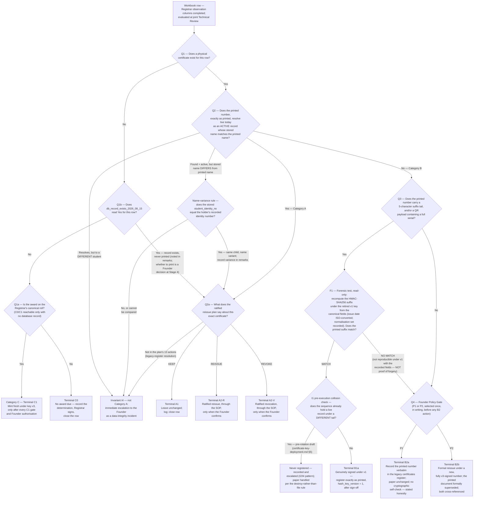

# 03 — The Decision Tree

**SHRS Registrar Reconciliation Pack — document 3 of 7.**
**Authority:** the Founder's Registrar Reconciliation Preparation Directive, 15 August 2026.
**Status:** PREPARED — AWAITING THE REGISTRAR. No lifecycle action has been taken.

> **The freeze is in force.** Nothing in this document performs, or authorises anyone to
> perform, any action. No key is generated, no certificate is minted, no record is
> created or modified in the production database, and no REISSUE or REVOKE is executed
> until the full sign-off chain of the SOP (`04-sop.md`) — **Registrar → Technical →
> Cryptographic → Founder** — has been completed for that action. Every terminal in this
> tree is a *classification*, not a command.

---

## 1. Standing and purpose

The workbook (`02-workbook.csv`) brings the five sources of truth face to face, one row
per certificate. This document is the next step in the chain the charter
(`01-README.md`) describes: it turns **each completed workbook row into exactly one
documented institutional action**.

The tree is **deterministic**. Every question is answered Yes or No from evidence already
recorded — the Registrar's observation columns, the ratified reissue plan
(`docs/graduation-registers/reissue-plan-2026.json`), the canonical roll
(`docs/graduation-registers/canonical-roll-2026.json`), and a fresh read-only query of
the live public verification service. **No question in this tree asks anyone's opinion.**
Two people applying it to the same completed row must reach the same terminal, or the
tree is defective and must be corrected before use.

Every branch terminates in exactly one of the eight terminal action codes (Section 6),
**or** in the invariant **I4** incident escalation (Section 7), **or** in an explicit
`[TO BE CONFIRMED BY REGISTRAR]` hold. A terminal is written into the row's
`final_classification` and `recommended_action_code` columns; an I4 escalation or a
hold is recorded as such, and a row carrying either proceeds to no action. Nothing
further happens to any row until the SOP's sign-off chain is complete and the
implementation plan (`07-implementation-plan.md`) is authorised to run.

## 2. When and by whom the tree is applied

1. The Registrar completes the observation columns of the workbook for every row
   (guidance: `02-workbook-guide.md`).
2. At the **joint Technical Review** (SOP stage 2), the Registrar and the Technical
   reviewer sit with the completed workbook and apply this tree to each row in order,
   row 1 to row 51.
3. For each row they record: the answer to each question reached, the evidence reference
   for each answer (in `supporting_evidence_ref`), and the single terminal reached.
4. Where an answer cannot be established from evidence, the row is **not** guessed at:
   it is marked `[TO BE CONFIRMED BY REGISTRAR]` and set aside for completion. A row
   with any unanswered question has no terminal and proceeds to no action.

## 3. Definitions used by the questions

These definitions exist so that every question below is mechanical.

| Term | Meaning, precisely |
|---|---|
| **Physical certificate exists** | The workbook column `physical_certificate_exists` reads **Yes** — i.e. the Registrar has confirmed a printed document is, or has been, in a student's hands for this row. |
| **On the canonical roll** | The student-and-programme award appears in `docs/graduation-registers/canonical-roll-2026.json`, the Registrar's own Founder-ratified roll of 44 awards. A name matches if it is the **chosen form** in the category's name list **or** appears in the corresponding `fullerNamesAdopted` "seen" array for that category; where an identity number is available, it is the tie-breaker. Worked lookup example: "Ashrof Akorede" (workbook row 5) **is** on the IBT roll — it appears in the "seen" list for the adopted "Ashraf Korede Ojewumi". |
| **Resolves live** | A read-only request to the public verification service — `GET https://shroyalschools.com/api/certificates/verify?ref=<the number exactly as printed>` — performed at the joint Technical Review and recorded in `supporting_evidence_ref`, returns a found record. The evidence baseline of 2026-08-15 (presence audit run `31862779664`, commit `afb80e87`: exactly 13 records, sequence numbers 000035–000047; acceptance run `31857567994`: all 13 verify on every printed identifier, status active) informs expectations, but Q2 is always answered from the fresh query, never from the baseline alone. |
| **Active record, name matches** | The live response shows `status: active` **and** its stored recipient name is identical to the name printed on the document. An integrity reading of `pending_signature` (the honest key-unavailable state currently shown by the six I'dādiyyah certificates) **counts as resolving** — Q2 asks whether the record exists, is active, and names the right student; it does not require the deeper cryptographic check to be currently possible. A stored name that is **not** identical to the printed name is decided by Q2's name-variance sub-branch, mechanically, never by impression. |
| **Suffix tail** | The five-character block at the end of a printed number (e.g. the `368DC` in `SHRS-CERT-IBT-000035-368DC`). It is the first five hexadecimal characters, uppercased, of the certificate's own HMAC-SHA256 content hash (`functions/_lib/certificate-serial.js`). A QR code whose payload contains a full serial number **includes** such a suffix and counts as one being present. A number in the style `SHRS-CERT-JSS-000048`, with no five-character tail and no QR serial, carries none. |
| **The ratified plan** | `docs/graduation-registers/reissue-plan-2026.json`, Founder-ratified 8 August 2026 — 6 KEEP, 4 REISSUE, 3 REVOKE against the 13 issued certificates, plus 38 planned mints. Ratified but, under the freeze, **unexecuted**. |
| **Legacy certificates register** | The `certificates` database table. The public verifier, when a well-formed stage number matches no stage record, deliberately falls through to this table (`functions/api/certificates/verify.js`), which resolves by a free-form, staff-assigned `reference_no` and carries **no cryptographic hash**. This is the mechanism terminal B2a relies on. |
| **Founder Policy Gate (P1 / P2)** | Before any B2 action is taken anywhere in the pack, the Founder selects **once, in writing**: **P1** — legacy registration suffices for already-printed unsigned documents; or **P2** — every circulating credential must be cryptographically signed, so B2 documents are reissued. The chosen policy then applies mechanically to every B2 row. There is no per-certificate discretion. |

## 4. The decision tree — the questions in full

Apply to each workbook row in turn, starting at Q1.

### Q1 — Does a physical certificate exist for this row?

Read the row's `physical_certificate_exists` column.

- **No** → go to **Q1b**.
- **Yes** → go to **Q2**.

### Q1b — Does the workbook's `db_record_exists_2026_08_15` column read Yes for this row?

A physical certificate may never have been printed while a live database record
nevertheless exists (all 13 issued rows carry one at the baseline). The database
dimension is consulted **before** any Category C terminal can be reached.

- **Yes** → the live record must receive its ratified handling even though no paper
  exists. Go to **Q2a** and apply the plan lookup, so the record receives its
  **A1 / A2-R / A2-V** treatment; write *"record exists, never printed"* in
  `registrar_remarks`. Whether a physical document is later printed from the existing
  record is a **Founder decision recorded at Stage 4**, not an outcome of this branch.
- **No** → go to **Q1a**.

### Q1a — Is this award on the Registrar's canonical roll?

Reached only when **no database record exists** for the row (Q1b = No) — terminals C0
and C1 are reachable **only** for rows with no database record. Look the student and
programme up in `canonical-roll-2026.json`, applying the membership rule of Section 3.

- **Yes** → **Category C** → terminal **C1**: mint fresh under key v3 — but only after
  every one of the C1 gates in Section 6 is passed: the v3 custody decision and
  generation ceremony (key v3 **does not currently exist**), the Founder-approved
  bilingual `PROGRAMMES` registry additions where the programme code requires one,
  the completed renumbering of the plan's provisional allocations (invariant I1), and
  the Founder's authorisation, all per the SOP.
- **No** → terminal **C0**: no certificate is due. The determination is recorded on the
  row, the Registrar signs it, and the row is closed. Nothing is minted and nothing is
  registered.

### Q2 — Does the printed number, exactly as printed, resolve on the live public verification service today as an active record whose stored name matches the printed name?

Take the number from `printed_certificate_no_exact` — character for character as it
appears on the paper — and query it live (read-only) at the review. Record the response
reference in `supporting_evidence_ref`. All three conditions must hold: **found**,
**active**, **name identical**.

- **Yes** → **Category A** → go to **Q2a**.
- **No** (not found; or found but not active; or the printed suffix pins the lookup and
  finds nothing) → **Category B** → go to **Q3**. (A record that is **found and
  active** but under a differing name is **not** answered No — the name-variance
  sub-branch below decides it.)
- **Found and active, but the stored name is not identical to the printed name** →
  decided mechanically by identity number, never by impression: if the stored
  `student_identity_no` equals the identity number recorded for the holder, it is the
  **same child under a name variant** — treat the row as resolving (**Q2 = Yes**),
  proceed to **Q2a**, and record the variance in `registrar_remarks`. If the identity
  numbers **differ**, or **cannot be compared**, escalate under invariant **I4**.
- **It resolves, but to a different student's record** → this is **not Category A and
  not Category B**. Stop. Apply invariant **I4**: escalate to the Founder immediately as
  a data-integrity incident. (Expected count of such cases: zero.)

### Q2a — What does the ratified reissue plan say about this exact certificate?

Look the full stored serial up in the `actions` list of `reissue-plan-2026.json`.

- **KEEP** → terminal **A1**: leave the certificate entirely unchanged; log the
  determination; close the row.
- **REISSUE** → terminal **A2-R**: the ratified reissue is executed through the SOP
  **when the Founder confirms**; until that confirmation, no change of any kind is made.
- **REVOKE** → terminal **A2-V**: the ratified revocation is executed through the SOP
  **when the Founder confirms**; until that confirmation, no change of any kind is made.
- **The reference appears in none of the plan's 13 actions** — possible where the
  number resolved via the legacy certificates register — → the row is escalated as a
  **data-integrity finding under the I4 pattern**. It is never classified mechanically.

### Q3 — Does the printed number carry a five-character suffix tail, and/or is there a QR payload containing a full serial?

Read the row's `printed_certificate_no_exact`, `printed_qr_present` and
`qr_payload_exact` columns.

- **Yes** (a tail is printed, or the QR payload carries a full serial) → perform
  forensic test **F1**.
- **No** (a bare number in the `SHRS-CERT-JSS-000048` style) → go to **Q4**.

### F1 — Forensic test: is the printed suffix cryptographically reproducible under retired key v1?

Performed by the Technical reviewer at the joint review. **Entirely read-only** — it
computes a hash on a workstation; it touches no key store, no database, and no
production system, and it generates nothing.

1. Reconstruct the canonical hash field set exactly as
   `certificateHashFields` in `functions/_lib/certificate-serial.js` defines it:
   `serialBase` (rebuilt as `SHRS-CERT-<programme>-<year>-<sequence>`, the year taken
   from the ISO-converted printed issue date — the printed number omits the year by
   design), `studentIdentityNo` (as printed; hashed as the empty string if the paper
   carries none, exactly as the code does), `studentFullName` **as printed**,
   `programmeCode`, `academicYear` = `2025/2026`, `gradeEn` (per the normalisation set
   below), and `issuedAt` — **the printed issue date converted to the ISO `YYYY-MM-DD`
   Gregorian form before hashing**, matching `isoDateOnly()` and the sealed registers
   (`"issuedAt": "2026-08-08"`). The raw printed string — `8 August 2026`,
   `08/08/2026`, a Hijri date — is **never** hashed as-is: at genuine issuance the
   HMAC input was the ISO form, so hashing the printed string would guarantee a false
   NO MATCH for a genuine document.
2. Recompute the HMAC-SHA256 over those fields under **the retired v1 key** — the
   value held in Cloudflare Production as `DOCUMENT_HASH_SECRET_V1`, recorded in
   `docs/certificate-key-deployment.md` section 2. The key literal is never written
   into pack documents.
3. Take the first five hexadecimal characters, uppercased, and compare them with the
   printed suffix.

The reviewer tries the enumerated **normalisation set** — `gradeEn` exactly as printed
**and** as the batch convention `Excellent` (the issued batches hashed
`gradeEn = 'Excellent'` even where the paper prints no grade); the date as
ISO-converted — and records on the F1 worksheet exactly which combination, if any,
reproduced the suffix.

**Tail/code disagreement rule.** Where the paper also carries a printed 12-character
verification code, both values are compared. If the 5-character tail matches but the
printed 12-character verification code does not (or vice versa), the result is
**NO MATCH**; record both values on the F1 worksheet.

- **MATCH** → first apply invariant **I1**'s pre-execution collision check: if the
  printed number's sequence **already holds a live record under a different tail**,
  this is the pre-rotation-draft case of Section 7 (I1) — the document is **never
  registered**; it is recorded, escalated under the I2/I4 pattern, and the paper
  handled per `docs/certificate-key-deployment.md` section 5's
  destroy-rather-than-file rule. Otherwise → terminal **B1a**: the document was
  genuinely signed under v1. After the sign-off chain (Registrar, Technical, and the
  Founder's authorisation, through the full SOP chain), the row is registered
  **exactly as printed**, with `hash_key_version = 1` and the recomputed
  `content_hash`. The paper is not touched and becomes fully verifiable, suffix and
  all.
- **NO MATCH** → fall through to **Q4**. State the finding plainly and only as this:
  *"not reproducible under v1 with the recorded fields."* A negative F1 is **not proof
  of forgery** — a one-character difference in the recorded name, identity number, or
  date breaks the HMAC completely. The tree treats a non-reproducible suffix exactly as
  it treats a document with no suffix at all.

If any field needed for step 1 cannot be established from the paper or the Registrar's
record, F1 is recorded as *"not performable — [TO BE CONFIRMED BY REGISTRAR]"* and the
row waits; it does not proceed on a guessed field.

### Q4 — The Founder Policy Gate

The Founder's one-time written selection (Section 3) decides every row that reaches
this question. No B2 action of either kind may be taken before the selection exists in
writing.

- **P1 selected** → terminal **B2a**: after sign-off, the printed number is recorded
  **verbatim** in the legacy `certificates` register, with the student's name, the
  credential type, and the issue date. The public verifier then resolves that exact
  printed number as an active institutional credential (via the deliberate fall-through
  described in Section 3). The paper is unchanged. The record carries **no cryptographic
  self-check**, and the evidence pack (`06-evidence-pack.md`) says so honestly.
- **P2 selected** → terminal **B2b**: after sign-off, a formal reissue — a new,
  fully v3-signed certificate under a **new** number; the printed document is formally
  superseded and recalled or stamped per the Registrar's procedure; both documents are
  cross-referenced in the register.

## 5. The tree as one picture

## 6. Terminal actions

Every terminal is an **entry in the approved-actions list** that the implementation plan
runs only **after** the full SOP sign-off chain. No terminal executes anything by being
reached.

| Code | What it means (after authorisation, never before) | Gates that must ALL be passed first | Execution specified in | Rollback specified in |
|---|---|---|---|---|
| **A1** | Leave the certificate entirely unchanged; log the determination; close the row. | Registrar sign-off on the completed row; joint Technical Review concurrence; Founder acceptance of the reconciliation, per `04-sop.md`. | `07-implementation-plan.md` (recording/closure only — no system change) | `05-rollback-plan.md` (reopening a closed row) |
| **A2-R** | Execute the ratified reissue of this certificate exactly as `reissue-plan-2026.json` states. | Full sign-off chain (Registrar → Technical → Cryptographic → Founder); the Founder's explicit confirmation to execute; the replacement mint is a separate row's C1 with its own gates. | `07-implementation-plan.md` | `05-rollback-plan.md` |
| **A2-V** | Execute the ratified revocation of this certificate exactly as `reissue-plan-2026.json` states. | Full sign-off chain; the Founder's explicit confirmation to execute. | `07-implementation-plan.md` | `05-rollback-plan.md` |
| **B1a** | Register the row exactly as printed, with `hash_key_version = 1` and the recomputed `content_hash`; the paper is unchanged and becomes fully verifiable. | A documented F1 **MATCH** (the printed suffix cryptographically reproduced under v1); full sign-off chain, including Registrar, Technical, and Founder sign-off on this specific registration. | `07-implementation-plan.md` | `05-rollback-plan.md` |
| **B2a** | Record the printed number verbatim in the legacy `certificates` register (name, credential type, issue date); it then resolves publicly as active; no cryptographic self-check, stated honestly in `06-evidence-pack.md`; paper unchanged. | The Founder Policy Gate selected **P1**, in writing; full sign-off chain. | `07-implementation-plan.md` | `05-rollback-plan.md` |
| **B2b** | Formal reissue under a new, fully v3-signed number; printed document formally superseded and recalled/stamped per the Registrar's procedure; both cross-referenced in the register. | The Founder Policy Gate selected **P2**, in writing; key v3 exists (custody decision + generation ceremony completed); Founder-approved bilingual `PROGRAMMES` registry addition where the programme code requires one; target number cleared under invariant I1; full sign-off chain. | `07-implementation-plan.md` | `05-rollback-plan.md` |
| **C0** | No certificate is due. Record the determination; the Registrar signs; close the row. Nothing is minted or registered. | Reachable only for a row with **no database record** (Q1b = No); Registrar sign-off; joint Technical Review concurrence; Founder acceptance of the reconciliation. | `07-implementation-plan.md` (recording/closure only) | `05-rollback-plan.md` (reopening a closed row) |
| **C1** | Mint a fresh, fully v3-signed certificate for a roll award with no physical document. | **All of:** the row has **no database record** (Q1b = No); the v3 custody decision and generation ceremony (key v3 does not yet exist — its generation is itself a gated future step); Founder-approved bilingual `PROGRAMMES` registry additions for QUR, PRY, JSS and SS as required (at the evidence baseline — `main`, `afb80e87` — the registry holds IBT, IDD, THN **and TMH**, the TMH entry Founder-confirmed on 8 August 2026 and locked in the file itself, so TMH needs no registry change); completed renumbering of the plan's provisional allocations 48–85 around every number physically in circulation (invariant I1); the Founder's authorisation; full sign-off chain. | `07-implementation-plan.md` | `05-rollback-plan.md` |

**Programme-registry note (affects B2b and C1).** `functions/_lib/certificate-serial.js`
can mint only programme codes in its `PROGRAMMES` registry, which at the evidence
baseline (`main`, `afb80e87`) holds **four** codes: **IBT, IDD, THN and TMH** — the TMH
entry Founder-confirmed on 8 August 2026 and locked in the file itself. New registry
entries are required only for **QUR, PRY, JSS and SS**: no certificate under those four
codes can be minted until the registry carries them with Founder-approved bilingual
labels — a change that is itself frozen until authorised through the sign-off chain.
**TMH needs no registry change**: the file's own belt-and-braces note that the engraved
wording "holds one confirmation before the first sheet is minted" is satisfied by the
Founder's Stage 4 signature on the TMH mint action. Known discrepancy: the file's TMH
comment lines ("TMH has no roster and no serial range… continues after QUR's 000074,
at 000075") predate the ratified plan (TMH = seq 52; QUR = 48–51) and are a **stale
code comment** — recorded here as such, to be corrected in the same reviewed commit as
the QUR/PRY/JSS/SS registry additions, not before.

## 7. Cross-cutting invariants

These apply to **every** row, at every terminal, without exception.

1. **I1 — Sequence uniqueness.** No sequence number may ever exist on two live
   documents. Before any C1 mint, B2b reissue **or B1a registration** is authorised,
   its target number must be checked against (a) every printed number recorded anywhere
   in the workbook and (b) the live database. Any collision forces renumbering of the
   **plan** — never of a printed document. A number printed on paper in a child's hand
   outranks a number in a JSON file. (Known instance: the plan allocates sequence 48 to
   a QUR certificate, while a physical `SHRS-CERT-JSS-000048` is Founder-reported in a
   student's hands, 15 August 2026. Plan allocations 48–85 are therefore provisional
   pending renumbering.)
   **Pre-rotation drafts:** a printed number whose sequence already holds a live record
   under a **different** tail is the pre-rotation-draft case of
   `docs/certificate-key-deployment.md` section 5 — proofs and drafts printed before
   2026-08-06 carry the old v1-era tails for sequences 000042–000047 (`A775E`, `B1092`,
   `11615`, `09B22`, `20726`, `6AFD4`). Such a document is **never registered**: it is
   recorded, escalated under the I2/I4 pattern, and the paper handled per that
   document's destroy-rather-than-file rule.
2. **I2 — Two documents, one award.** Where a student-and-programme pairing has two
   physical documents (for example an older REISSUE-marked certificate plus a newer
   print), the ratified plan resolves which stands. The extra document is recorded in
   the row's `registrar_remarks` and handled by **its own row's** branch through this
   same tree — no document is resolved off the books.
3. **I3 — No branch executes anything.** Reaching a terminal changes nothing anywhere.
   Every terminal is an entry in the approved-actions list that the implementation plan
   (`07-implementation-plan.md`) runs only **after** the full SOP sign-off chain
   (Registrar → Technical → Cryptographic → Founder) is complete for that action.
4. **I4 — Wrong-student resolution is an incident, not a category.** If a printed
   number resolves live but to a **different student's** record, the row is not
   Category A and does not continue through the tree. It is escalated to the Founder
   immediately as a data-integrity incident. Expected count of such cases: **zero** —
   any occurrence is itself a significant finding.

## 8. Worked examples

The Registrar's observation columns are blank until the Registrar completes them; the
physical-existence answers below are therefore illustrative expectations, marked where
they await confirmation. The plan lookups and live-service answers are cited from the
pinned evidence baseline.

### 8.1 Workbook row 1 — `SHRS-CERT-IBT-2026-000035-368DC` (Hameedah Adebimpe Ojewumi, IBT)

| Step | Question | Answer | Evidence |
|---|---|---|---|
| Q1 | Physical certificate exists? | Expected **Yes** — the ratified plan records the 13 as physical certificates in circulation. Column value: [TO BE CONFIRMED BY REGISTRAR]. | Audit §2.1; workbook row 1 |
| Q2 | Printed number resolves live, active, name matches? | **Yes** — all 13 verify on every printed identifier and QR payload, status active; live integrity `intact`. | Acceptance run `31857567994`, 2026-08-15T01:50 UTC |
| Q2a | Ratified plan says? | **KEEP** | `reissue-plan-2026.json`, `actions` entry for `SHRS-CERT-IBT-2026-000035-368DC` |
| **Terminal** | | **A1** — leave unchanged; log; close row. No action of any kind. | |

If the Registrar instead records `physical_certificate_exists = No` for this row, it
does **not** fall to Q1a: `db_record_exists_2026_08_15` reads Yes, so **Q1b** routes it
to the same plan lookup (KEEP → A1), with *"record exists, never printed"* noted in
`registrar_remarks`; whether to print from the existing record is a Founder decision
recorded at Stage 4. The same Q1b routing protects every issued row — for example,
row 8's ratified revocation (A2-V, example 8.2) remains reachable even if no paper is
ever found for it.

### 8.2 Workbook row 8 — `SHRS-CERT-IDD-2026-000042-56798` (Muhammad Ismail Seriki, IDD)

| Step | Question | Answer | Evidence |
|---|---|---|---|
| Q1 | Physical certificate exists? | Expected **Yes** — as above. Column value: [TO BE CONFIRMED BY REGISTRAR]. | Audit §2.1; workbook row 8 |
| Q2 | Printed number resolves live, active, name matches? | **Yes.** The live integrity reading is `pending_signature` (key v2 is lost), but that is the honest key-unavailable state, not a mismatch — the record is found, active, and names the right student, so Q2 is answered Yes. | Acceptance run `31857567994`; audit §2.1, §3 |
| Q2a | Ratified plan says? | **REVOKE** — "not on the Registrar's IDD roll"; his roll awards are plan seq 58 (IBT) and 79 (JSS), each with its own workbook row. | `reissue-plan-2026.json`, `actions` entry for `SHRS-CERT-IDD-2026-000042-56798` |
| **Terminal** | | **A2-V** — the ratified revocation is executed through the SOP **when the Founder confirms**; until then, no change. Under the freeze, this certificate continues to verify as active. | |

### 8.3 A hypothetical JSS row — printed `SHRS-CERT-JSS-000048`, no suffix

A physical certificate printed `SHRS-CERT-JSS-000048` is Founder-reported (with a
screenshot of the live verification page) as already in a student's hands,
15 August 2026. The holding student and the row it attaches to are
[TO BE CONFIRMED BY REGISTRAR].

| Step | Question | Answer | Evidence |
|---|---|---|---|
| Q1 | Physical certificate exists? | **Yes** — Founder-reported with screenshot, 2026-08-15. | Charter §"A known numbering collision"; audit §4.7 |
| Q2 | Printed number resolves live, active, name matches? | **No** — sequence 48 is among the 137 numbers with no record; the screenshot itself shows "No record on file for this number". | Presence audit run `31862779664`, 2026-08-15T03:48–03:50 UTC, commit `afb80e87` |
| Q3 | Suffix tail or QR serial present? | **No** — the number is the bare `SHRS-CERT-JSS-000048` style, with no five-character tail. (F1 is therefore not performable and is skipped by design.) | Registrar's recorded observation of the paper |
| Q4 | Founder Policy Gate — P1 or P2? | Whichever the Founder has selected once, in writing. [TO BE CONFIRMED — the selection has not yet been made.] | The written policy selection, when made |
| **Terminal** | | **P1 → B2a**: after sign-off, `SHRS-CERT-JSS-000048` is recorded verbatim in the legacy register and thereafter resolves publicly as active; the paper is unchanged; no cryptographic self-check, and the evidence pack says so. **P2 → B2b**: after sign-off, a new fully v3-signed certificate under a new number; the printed one formally superseded; both cross-referenced. | |

**Invariant I1 applies either way:** the plan's allocation of sequence 48 to a QUR
certificate (Aisha Omoshalewa Anofi) collides with this printed document, so the
**plan** is renumbered around the paper — never the paper around the plan. And under
the programme-registry note in Section 6, the B2b path additionally waits on a
Founder-approved JSS addition to the `PROGRAMMES` registry before any v3 mint.

## 9. Recording the outcome

For each row, the joint Technical Review writes:

1. `final_classification` — the category and terminal reached (e.g. `A — A1`,
   `B — B2a`, `C — C1`).
2. `recommended_action_code` — the terminal code alone. One holding value is also
   valid at Stage 2 exit: **`B2 — pending P1/P2`**, for a B-category row that has
   reached Q4 while the Founder's written P1/P2 selection is still outstanding
   (defined in `04-sop.md` Stage 2). It resolves mechanically — to `B2a` under P1 or
   `B2b` under P2 — the moment the written selection exists, with no further review.
3. `supporting_evidence_ref` — the evidence for every question answered on the way
   (live query reference, plan entry, roll entry, F1 worksheet where performed).
4. Sign-offs (`registrar_signoff`, `auditor_signoff`) — per the SOP.

The completed workbook — every row carrying exactly one of the eight terminal action
codes, or the `B2 — pending P1/P2` holding classification, or a recorded I4
escalation, or an explicit `[TO BE CONFIRMED BY REGISTRAR]` hold (the latter two
proceed to no action; the holding classification resolves mechanically on the
Founder's written P1/P2 selection) — then proceeds
through the SOP chain: **Registrar → Technical → Cryptographic → Founder**. Only after
the Founder's signature does the implementation plan run any terminal — and each
executed action remains reversible per `05-rollback-plan.md` until publication.
