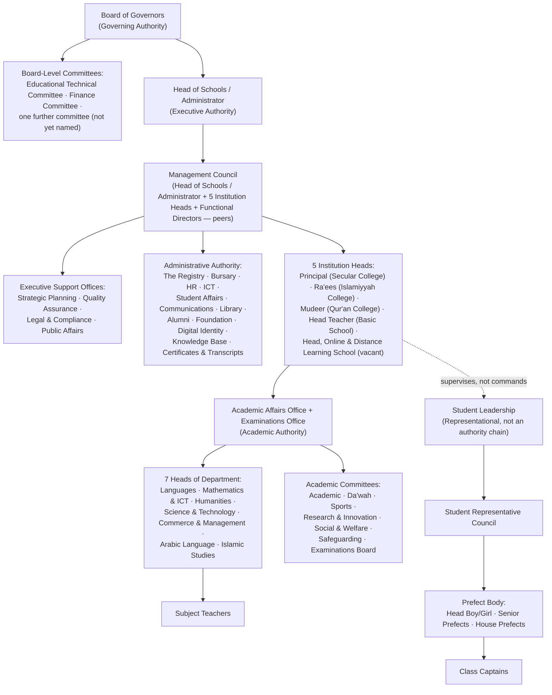

# SHRS Institutional Governance & Academic Structure — Architect's Report

**Status:** Advisory only, pending Board adoption. Nothing in this document changes the live system, the Constitution (Policy GV-01), or any published page. It is written as source material for a future Board resolution and a future GV-01 amendment.

**Author's stance:** I have not agreed with the draft supplied to me. Where the existing project record disagrees with the brief I was given, I say so plainly below, with citations. Where I judge my own prior work in this engagement to be wrong, I say that too — including work built in earlier sessions of this same project.

---

## 0. What I found before writing a word of this

I did not draft this from a blank page. Before recommending anything, I searched the project's actual history — its Constitution, its seeded database, its docx/prospectus scripts, its git log — because a governance document that contradicts the institution's own paper trail is worse than useless. Four findings change what you asked me to do.

**0.1 — The Constitution does not currently contain the hierarchy you gave me, in any form.**
Policy GV-01 (`docs/policies/constitution-governance-charter.md`, v2.0, "Effective Date: Not yet effective — pending Board adoption") states one hierarchy only: **Board of Trustees → Executive Management Team → the four institutions.** It names no Heads of Department, no "Educators" tier, no Standing Committees tier, and no student-leadership tier at all. The ten-level structure you gave me — School Board → Founder/CEO/Administrator → Management Team → Heads of Department → Educators → Standing Committees → Student Representatives → Prefects → Class Captains → (vacant) — does not exist in the Constitution. It exists, in a nine-level form (no vacant tenth slot), only inside **prospectus and marketing-brochure generation scripts** (`scripts/generate-definitive-docx.js`, `scripts/generate-masterplan-docx.js`), introduced in commit `7348091` ("Expand governance into a full 3-page architecture"). That commit's own message calls it "real institutional structure for publication," but it was never carried into GV-01, never given a database row, and never given a reporting mechanism. **You were right not to trust it — it is publication copy, not adopted governance,** and its central design flaw (explained in §2 below) is that it puts committees, students, and staff on one undifferentiated ladder.

**0.2 — Your five "currently functional standing committees" do not appear anywhere in this project's prior record.**
Academic Committee, Da'wah Committee, Sports Committee, Research & Transformation Committee, Social & Welfare Committee — none of these five, as a set, exist in any prior SHRS document, page, or database row I could find. I am treating this as you telling me new, real, ground-truth fact about the actual school — not as a contradiction I need to resolve. But it does mean two things for you to know: (a) these five committees have no existing digital footprint to preserve, so nothing is lost by renaming any of them if the name is wrong; and (b) the project's marketing copy separately invented a **different** six-committee list (Academic, Disciplinary, Welfare, Examination, Events, Safeguarding Committees, in the same prospectus scripts) that was never reconciled against reality. Your five and that fictional six overlap only partially. §4 below reconciles all of this into one list.

**0.3 — A seventh academic department exists in the record, and it was quietly dropped.**
The canonical academic department list used by the live AI assistant and the earliest editorial documentation (`docs/editorial-bible.md`, `functions/api/chat.js`) names **seven** departments: Languages, Mathematics & ICT, Humanities, Science & Technology, **Commerce & Management**, Arabic, Islamic Sciences. When the nine-level governance chart was built (commit `7348091`, described above), its "Heads of Department" tier quietly dropped to **six**, cutting Commerce & Management, in the same file that elsewhere still cites the full seven. **The recovered seventh department is Commerce & Management** — Financial Accounting, Commerce, Economics, Bookkeeping, Marketing, Business Studies. I recommend it be restored (§3.4).

**0.4 — The "Founder Authority" principle you're asking me to design is already built and enforced in code, not just proposed.**
The live administration system already enforces: only an existing Executive may grant or revoke the Executive role (`requireExeToTouchExe`, `functions/api/portal/admin/staff.js`); nobody may delegate a role they do not themselves hold, and every delegation carries a mandatory, computed expiry (`functions/api/portal/staff/delegations.js`); and every appointment, role grant/revocation, and delegation is retained in a single permanent, chronological Authority Register (`functions/api/portal/admin/authority-register.js`). §7 below writes this into constitutional language rather than proposing a parallel mechanism that would compete with what already exists.

I also owe you a confession before §5: several titles built into the live staff portal **during this same engagement** — "Founder Command Centre," "Institutional Command Centre," "Royal Institutional Command Shell," planned "Executive Command Centre 2.0," and the phrase "Governance Headquarters" that I myself used two tasks ago to label a set of new offices — are exactly the register your brief tells me to strike from a prestigious school. I did not notice this until you asked me to look. §5 names every instance and what it should become.

---

## 1. Verdict, up front

The draft hierarchy is not fit to enter a constitution and should not be adopted in the form you gave me. Its defect is structural, not cosmetic: it puts **authority** (who may direct whom), **representation** (who speaks for whom), and **working bodies** (committees, which do neither) onto one single ladder. A committee is not a rank between "Educators" and "Student Representatives" — it is a body that reports *into* a specific point of the real chain. A Class Captain does not report to a "Standing Committee" in any institution I have advised; a Class Captain answers to their Class Teacher, full stop.

Real institutions of the calibre SHRS is aiming for — Oxford, the Commonwealth-affiliated schools I have worked with, Qatar Foundation's schools — do not use one ladder. They use **four separate, parallel authority chains that converge only at the top**, plus a **fifth track that is representational, not authority-bearing**, for students. That is the model in §2.

---

## 2. The ideal governance hierarchy

### 2.1 Governing Authority — sets policy, does not manage

**Board of Governors** (apex, constitutional). Meets periodically. Its job is stewardship of the mission, appointment of the Head of Schools / Administrator, approval of policy and budget, and — the thing schools most often get wrong — **staying out of day-to-day management.** It governs through its Board-Level Committees (§4.1), never by individual Governors issuing instructions to staff. *(Note: per the Board's governance restructuring amendment of 2026-08-04, the Board-Level Committees actually adopted are the Educational Technical Committee, the Finance Committee, and one further committee not yet named — narrower than the six committees this report's §4.1 recommends below; see `docs/policies/constitution-governance-charter.md`.)*

*Why it exists separately from everything else:* a governing body that also manages operations cannot hold its own executive accountable. This is the single most-litigated failure mode in independent-school governance worldwide.

### 2.2 Executive Authority — delegated, accountable to the Board

**Founder & Chief Executive Officer** — the sole executive office accountable to the Board. Everything below this line derives its authority from the CEO, directly or by further delegation (§7).

**Management Council** — the Head of Schools / Administrator plus the institution heads (Principal, Ra'ees, Mudeer, Head Teacher, and, once appointed, the Head of the fifth institution recognised by the 2026-08-04 amendment) plus the functional directors (Registrar, Bursar/Finance, HR, ICT). A peer body: no member outranks another; the Head of Schools / Administrator chairs. This is already real (`Management Council` office, `sql/schema.sql`) and correctly modelled — keep it exactly as built.

**Executive Support Offices** — Strategic Planning, Quality Assurance, Legal & Compliance, Public Affairs. These already exist as real offices. My one structural (not cosmetic) recommendation: **reclassify them.** They are currently seeded with `layer = 'governance'`, siblings of the Board of Trustees. They are not. They support the *executive's* decision-making, not the Board's own apparatus. Reclassify to executive-support offices reporting to the CEO/Management Council. This matters beyond naming: as currently modelled, an org chart reader would conclude these four offices sit above the Management Council, which is false and would confuse any auditor reading the structure.

*Why executive authority exists separately from governing authority:* so the Board can hold the CEO accountable for outcomes without having authored the operational decisions itself.

### 2.3 Academic Authority — subject-matter, delegated by function not by seniority

**Academic Affairs Office** (cross-institutional curriculum standards) + **Examinations Office** + each institution's own Head → **seven** Heads of Department (§3.4) → subject teachers. Academic committees (§4.3) advise and support this chain; they are chaired by a relevant office- or department-head, never free-floating.

*Why academic authority is separate from executive authority:* a curriculum decision should be made on educational merit by people with subject expertise, not overridden by administrative convenience. Every serious university and school separates "who runs the institution" from "who decides what is taught and how it is assessed."

### 2.4 Administrative Authority — operational, delegated by function

Registrar's Office (Registry), Finance (Bursary), Human Resources, ICT/Digital Services, Student Affairs, Communications, Library, Alumni, the Sultan Hanafi Foundation, Digital Identity, Institutional Knowledge Base, Certificate & Transcript Office. All report to the CEO/Management Council for policy; all operate with day-to-day functional independence within their remit. Already substantially real and well-formed — see §6 for the one classification fix.

### 2.5 Student Leadership — representational and developmental, explicitly NOT an authority chain

**Student Representative Council → Prefect Body (Head Boy/Head Girl, Senior Prefects, House Prefects) → Class Captains.**

This is the single most important correction to the draft you gave me. A prefect is not a junior manager. A prefect holds specific, named, limited responsibilities delegated by a named member of staff (e.g., "report uniform infractions to the Class Teacher"; "assist with assembly line-up") — never general authority over other students, and never a place in the institution's actual chain of command. Every serious independent school keeps this distinction explicit precisely because conflating it invites both bullying-by-title among students and legal exposure for the institution when a student believes a peer had authority they did not. This track reports, for supervision purposes, to Student Affairs and each institution's Head — it does not sit "above" or "below" any other tier, because it is not on the same ladder at all.

---

## 3. Recommended offices — judged, not listed for quantity

I was given a candidate list and told explicitly not to recommend for the sake of quantity. Here is my judgment on each, plus what I found already exists.

**Already real — no action needed:**
Quality Assurance Office, Strategic Planning Office, Legal & Compliance Office, Student Affairs Office, Alumni Relations, and (functionally) Innovation & Digital Transformation via the existing Digital Learning & Innovation office.

**Recommend creating:**
- **Institutional Advancement Office** — the one genuine gap. The Sultan Hanafi Foundation office is scoped specifically to the Foundation's own scholarship/welfare programmes; the Board's Development Committee is a part-time governance body, not an operating function. Neither executes a fundraising strategy, manages donor relations, or runs a capital campaign. Recommend creating this office — but **sequence it**: stand it up when SHRS is fundraising at a scale that justifies a paid, dedicated function, not before. Creating a prestige office with no budget behind it is worse than not creating it.

**Recommend NOT creating as new offices — fold into what already exists:**
- **Internal Audit Unit** — this is the operational arm of the existing Board Audit Committee. Do not duplicate it as a parallel C-suite office. When transaction volume justifies it, add a dedicated internal auditor *reporting to the Audit Committee*, not a new office in the executive layer.
- **Institutional Research** — this is core Quality Assurance work (outcomes data and analytics), not a separate function. A standalone Institutional Research office at SHRS's current size would be over-engineering.
- **Risk Management** — covered jointly by Legal & Compliance and the Audit Committee. A standalone risk office at this scale duplicates both.
- **Guidance & Counselling** — Student Affairs' existing published mandate ("welfare, leadership development, clubs, pastoral-care coordination") already covers this by description. My recommendation is a staffing decision, not a structural one: formally establish a Guidance & Counselling *unit* within Student Affairs, staffed by a qualified counsellor, rather than create a fifth office.
- **Community Engagement** — fold into Public Affairs' mandate (see the Communications/Public Affairs boundary note below), not a new office.

**Recommend explicitly rejecting, for now:**
- **International Relations** — SHRS is a single-country, five-institution operation. An International Relations office at this stage is premature institutional empire-building; even schools with genuine international licensing arrangements typically run those through a contracts/legal function, not a standing diplomatic-style office. Revisit only if SHRS pursues an international curriculum accreditation (Cambridge, IB) or a satellite campus abroad — a real, specific trigger, not a general aspiration.

**A boundary that needs writing down, not a new office:** Communications already exists (day-to-day brand, press, parent-facing messaging, operational layer) and now sits alongside the newer Public Affairs (government/regulator liaison, formal external representation, executive-support layer). Without an explicit charter distinguishing the two, they will duplicate effort or compete for the same relationships. Write the boundary into each office's mandate rather than merging them — the functions are genuinely different in register even if they look similar from outside.

**3.4 — Academic departments: recovering the seven, correcting the naming.**
Restore all seven, with names corrected for consistency (the project used at least three different spellings of the same departments across different documents):

1. Languages Department (English, and other languages — French, Hausa, Chinese as offered; keep Arabic separate, see #6)
2. Mathematics & ICT Department
3. Humanities Department
4. Science & Technology Department
5. **Commerce & Management Department** (recovered — Financial Accounting, Commerce, Economics, Bookkeeping, Marketing, Business Studies)
6. Arabic Language Department
7. Islamic Studies Department (standardise on "Islamic Studies," not "Islamic Sciences" — both appear in the record; "Studies" is the more common international register and matches the School of Islamic & Arabic Studies' own name)

One further correction the record itself already makes correctly and should not be undone: **Qur'an College is not a subset of "Islamic Studies."** It is a separate institution with its own head (the Mudeer) and its own distinct curriculum register (Hifz, Tajweed, Qira'aat, Ijazah, Muraja'ah). Keep it institutionally separate from the Islamic Studies *department*, which sits inside the School of Islamic & Arabic Studies and Royal College's own curriculum.

---

## 4. Recommended committees

### 4.1 Board (governing) committees — keep five, add one

The existing five — Finance, Governance, Audit, Academic Excellence, Development — match international norms well and should be kept exactly as named. Recommend **one addition**: a **Nominations & Remuneration Committee**, separated out from the general Governance Committee's remit. Every serious governance code (UK Charity Governance Code, Commonwealth university codes, Independent Schools' Bursars Association guidance) treats appointments and succession oversight as a distinct committee, precisely because it is the committee that would need to act on Founder or Board succession — too consequential to bundle with routine constitutional housekeeping. This directly supports §7.

### 4.2 Management (operational) committees — formalise what already exists, add what's missing

Two committees are **already named and adopted** on the public governance page and should simply be carried into the Constitution rather than re-invented: the **Health and Safety Committee** and the **Complaints Committee** (three governors). Add:
- **Admissions & Enrolment Committee** — cross-institutional, since Admissions is already a shared office across all four schools.
- **Safeguarding Committee**, chaired by the Designated Safeguarding Lead (a role that already exists in the Permission Matrix with no committee built around it yet — this is a real gap, and the single highest-priority addition in this entire document from a child-protection standpoint).

### 4.3 Academic committees — reconciling your five against the record

Your five committees are real, current fact about the school, and I am not overriding them. Here is my judgment on each, and on how they interact with the fictional six-name list the project's own marketing copy separately invented (Academic, Disciplinary, Welfare, Examination, Events, Safeguarding).

- **Academic Committee** — keep as named. Standard, correctly registered, no issue.
- **Da'wah Committee** — keep the name and the function; it is authentically core to SHRS's identity, more so than at a generic school, and does not read as over-fitting. One structural note: SHRS has *two* distinct Islamic-education institutions (Qur'an College and the School of Islamic & Arabic Studies), each with its own Head. A single cross-institutional Da'wah Committee needs an explicit charter clause stating how it relates to those two Principals' authority, or it risks becoming a shadow chain of command that neither Head formally controls.
- **Sports Committee** — keep as named. Correctly registered, standard co-curricular committee.
- **Research & Transformation Committee** — **rename to Academic Research & Innovation Committee.** Two reasons. First, "Transformation" is exactly the consulting/corporate register your own brief asks me to strike, even applied to a committee rather than an office title — the same discipline should apply. Second, there is already a real named individual role, "Head, Research & Development," at Royal College; running a parallel "Transformation Committee" without stating that this Head chairs it risks an authority collision over who actually leads research direction. The renamed committee should be chaired by that same Head of Research & Development, and "Innovation" naturally connects it to the existing Digital Learning & Innovation office.
- **Social & Welfare Committee** — keep, close enough to the "Welfare Committee" already present in the aspirational marketing list to be recognised as the same body, not a new one. Write an explicit boundary against the Student Affairs *office*: the Committee is the volunteer/rotating staff-and-student body organising events and pastoral activity; Student Affairs is the permanent professional administrative function behind it.

**Two gaps from the marketing-copy list that I judge genuinely urgent, beyond your five:** Safeguarding (§4.2, above — this cannot wait) and an **Examinations Board**, the natural committee wrapper around the Examinations office's existing work (results integrity, assessment standards) — this office already exists with real responsibilities and currently has no committee oversight structure at all. **Two I judge non-urgent and would fold rather than stand up separately:** Disciplinary (fold into the Academic Committee and Student Affairs jointly until caseload justifies a standalone body) and Events (fold into Social & Welfare's existing mandate).

---

## 5. Title review — including where this engagement itself got it wrong

You asked specifically whether "Command Centre," "Headquarters," and "Operations Command" belong in a world-class school. They do not, and the live staff portal built across this engagement uses exactly this register in multiple places. Naming these plainly, not softening it:

| Found in the live system | Where | Verdict |
|---|---|---|
| "Founder Command Centre" | Portal branding, tasks across this engagement | Rename → **Office of the Founder & Chief Executive** |
| "Institutional Command Centre" | Founder/Executive portal restructure | Rename → folded into the above |
| "Royal Institutional Command Shell" | Portal app-shell branding, just built | This is internal login-shell plumbing — it does not need an ornamental name at all. Drop the name; call it what it is, the staff portal frame. |
| "Executive Command Centre 2.0" (planned, not yet built) | Roadmap item | Cancel this name before building it. Call it the **Executive Office Dashboard**, or fold it into the Office of the Founder & CEO. |
| "Governance Headquarters" | Public governance page H2, and my own label for the new offices two tasks ago | Rename → **Governance Secretariat** (the internationally standard term for a governing board's administrative apparatus — used by the UN, the Commonwealth, and most university councils) |
| "Basic Education Operations Centre" / "Royal College Academic Command Centre" / "Qur'an Excellence Command Centre" (school-leadership portal names) | Head Teacher, Principal, Mudeer portals | Rename → **Office of the Head Teacher / Principal / Mudeer** — simple, dignified, matches how Oxford colleges say "the Provost's Office," not "the Provost's Command Centre." |
| "Islamic Academic Leadership Centre" (Ra'ees portal) | Ra'ees portal | The one of the four that is already correctly registered — "Leadership Centre" reads as academic, not militaristic. Keep as-is, or fold to "Office of the Ra'ees" for total consistency with the other three. |
| "Treasury & Institutional Resources" | Finance portal | Rename → **Bursary** (the historically exact British independent-school term for the finance function) or, if "Bursar" feels unfamiliar to your audience, simply **Finance Office** — the database's own real name, currently overridden in the UI by "Treasury," which reads national/governmental rather than institutional. |
| "Registry Headquarters" | Registrar portal | Rename → **The Registry** — drop "Headquarters" entirely; this is exactly Oxford and Cambridge's own term for the function. |

None of this requires touching the underlying data, permissions, or code — every one of the systems behind these names is sound and does not need to be rebuilt, only relabelled. That is worth saying plainly: the substance of this engagement's build work holds up; a portion of its *naming* does not, and that is a title-and-copy fix, not an architecture fix.

---

## 6. Judging every naming convention previously introduced — keep, rename, never

**Keep, no change:** Board of Trustees; Executive; Management Council; Registrar's Office (as a database name — user-facing label becomes "The Registry," §5); Academic Affairs; Examinations; Admissions; Head Teacher / Principal / Ra'ees / Mudeer as office titles; Finance Office (as database name); Human Resources; Student Affairs; Communications; Library; Alumni; Sultan Hanafi Foundation; Digital Identity Office; Institutional Knowledge Base; Certificate & Transcript Office; Strategic Planning; Quality Assurance; Legal & Compliance; all five original Board committees.

**Rename:** "Governance Headquarters" → Governance Secretariat; every "Command Centre" / "Command Shell" instance (table in §5) → Office / Secretariat as specified; "Treasury & Institutional Resources" → Bursary or Finance Office; "Registry Headquarters" → The Registry.

**Reclassify (structural, not cosmetic):** Strategic Planning, Quality Assurance, Legal & Compliance, Public Affairs — currently modelled as governance-layer siblings of the Board of Trustees; should be executive-support offices reporting to the CEO/Management Council (§2.2).

**Should never have been used:** "Command Centre," "Command Shell," and "Operations Command" in any form, anywhere in the system. These words describe a military or national-security control room. However impressive they were intended to sound, they are the single worst possible register for an institution whose users include children, and their repeated use across this engagement (Founder, Head Teacher, Principal, and Mudeer portals; a planned "2.0") was a genuine miscalibration, not a one-off. Correcting it is pure relabelling — nothing about the underlying access control, data, or workflow needs to change.

---

## 7. Founder Authority — constitutional language, referencing what is already built

Recommended Constitution article, ready for Board discussion:

> **Article — Founder's Reserved Powers.** The Founder & Chief Executive Officer holds, from the institution's founding and until the Board of Trustees, by resolution and with the Founder's written consent, provides otherwise, the reserved and non-delegable powers of: (a) appointment and removal of members of the Management Council and of each institution's Head; (b) ratification of the chairs of Board standing committees; and (c) veto over any resolution materially affecting the institution's Islamic character or founding mission.
>
> All other executive authority is delegable. Every delegation must (i) name a specific delegate, (ii) state a specific and limited scope, (iii) carry a mandatory expiry, and (iv) be recorded in the institution's Authority Register. These four conditions are not aspirational — they are already enforced in the institution's administrative system: a delegation cannot be created without an expiry date, no person may delegate authority they do not themselves hold, and every appointment, role grant, role revocation, and delegation — including its eventual expiry or early revocation — is retained in a single permanent, chronological register available to the Board.

**Checks and balances.** The Board retains *constitutional* supremacy at all times — it can amend the Founder's reserved powers by the process above, but only with the Founder's own consent while the Founder is living and serving; this converts to full Board discretion automatically upon the Founder's death, incapacity, or voluntary full retirement (a standard "reversionary" clause used in founder-led institution charters, so the institution is never permanently locked to one person's continued involvement). The recommended new **Nominations & Remuneration Committee** (§4.1) is specifically tasked with monitoring succession readiness — the single governance function most independent schools discover they are missing only after a founder's sudden departure. The **Audit Committee** provides independent assurance, using the real Authority Register described above, that delegated authority is in fact being exercised within its recorded scope — not a new audit mechanism, but the existing one given an explicit constitutional mandate to use it for this purpose.

---

## 8. Tone and register — how this should read and feel

Everything above should read as an academic institution, never a corporation, a ministry, or a barracks. Preferred vocabulary: Office, Secretariat, Registry, Bursary, Board, Council, Committee, Directorate (sparingly — genuinely cross-functional coordination only), "Centre for [a specific, real academic purpose]" (e.g. a future "Centre for Qur'anic Studies" would be entirely appropriate; "Command Centre" never is, regardless of context). Avoid: Command, Headquarters, Operations, Transformation (as a noun describing a committee or office), Treasury (in the national-government sense), and any acronym-heavy label that reads like a systems-integrator's project codename.

---

## 9. Deliverables

### 9.1 Organogram

### 9.2 Board Structure
Board of Trustees (apex) → six standing committees: Finance, Governance & Nominations *(recommend splitting Nominations & Remuneration out as its own committee, §4.1)*, Audit, Academic Excellence, Development. Meets periodically; sets policy and budget; appoints and holds the CEO accountable; does not manage operations.

### 9.3 Executive Structure
Head of Schools / Administrator (sole executive, Board-accountable) → Management Council (Head of Schools / Administrator + 5 institution Heads + functional Directors, all peers) → Executive Support Offices (Strategic Planning, Quality Assurance, Legal & Compliance, Public Affairs — reclassified from governance-layer to executive-support, §2.2/§6).

### 9.4 Academic Structure
Academic Affairs Office + Examinations Office + 5 institution Heads → 7 Heads of Department (§3.4, Commerce & Management restored) → subject teachers, supported by the academic committees in §4.3.

### 9.5 Administrative Structure
The Registry, Bursary/Finance, Human Resources, ICT/Digital Services, Student Affairs (incl. a Guidance & Counselling unit), Communications, Library, Alumni, the Sultan Hanafi Foundation, Digital Identity Office, Institutional Knowledge Base, Certificate & Transcript Office — plus, when fundraising scale justifies it, a new Institutional Advancement Office (§3).

### 9.6 Standing Committees — full recommended list
**Board:** Finance · Governance · Nominations & Remuneration (new) · Audit · Academic Excellence · Development.
**Management:** Health and Safety (formalise existing) · Complaints (formalise existing) · Admissions & Enrolment (new) · Safeguarding (new, urgent).
**Academic:** Academic · Da'wah · Sports · Academic Research & Innovation (renamed) · Social & Welfare · Examinations Board (new).

### 9.7 Student Leadership Structure
Student Representative Council → Prefect Body (Head Boy/Head Girl, Senior Prefects, House Prefects) → Class Captains. Representational and developmental only; not part of the institutional authority chain (§2.5).

### 9.8 Reporting Lines
Governing (Board) → Executive (CEO/Management Council) → [Academic Authority *and* Administrative Authority *and* Executive Support Offices, three parallel branches, none reporting to another] → Departments/Offices → Teachers/Officers. Student Leadership reports for supervision purposes into Student Affairs and the relevant institution Head, outside this ladder entirely.

### 9.9 Recommended Office Names
See §5 and §6 in full; headline changes: Governance Secretariat (was Governance Headquarters), Office of the Founder & Chief Executive (was Founder/Institutional Command Centre), The Registry (was Registry Headquarters), Bursary or Finance Office (was Treasury & Institutional Resources), Office of the Head Teacher/Principal/Ra'ees/Mudeer (was the four school-leadership "Command Centres").

### 9.10 Recommended Committee Names
See §4 in full; headline change: Academic Research & Innovation Committee (was "Research & Transformation Committee" as given).

### 9.11 Constitutional Notes
Four parallel authority chains converging only at the Board/Founder (§2); Founder's Reserved Powers article with reversionary clause (§7); Executive Support Offices reclassified out of the governance layer (§2.2, §6); Student Leadership explicitly carved out of the authority chain (§2.5); the Authority Register already in production code should be named in the Constitution as the mechanism of record for §7, not re-specified as a new system.

### 9.12 International Best Practice Comparison
- **Oxford model** (Council/Congregation as governing body; Vice-Chancellor/Registrar as executive/administrative; Faculty Boards as academic authority) — the direct source for keeping governing, executive, and academic authority as separate chains rather than one ladder, and for "Registry"/"Bursary" as the correct register.
- **UK Charity Governance Code / Independent Schools' Bursars Association guidance** — the direct source for separating Nominations & Remuneration from general Governance Committee duties, and for treating internal audit as a Committee-reporting function rather than a standalone office at this scale.
- **Commonwealth university governance codes** — the direct source for treating "Secretariat" as the correct term for a governing board's own administrative apparatus, and for keeping student representative structures explicitly outside the institutional management chain.
- **Elite British independent schools (Eton/Harrow/Winchester model)** — the direct source for keeping Prefects/House system pastoral and developmental rather than authority-bearing, and for the "Office of the [Head's Title]" naming convention.

### 9.13 Final Recommendations, ranked
1. **Do not adopt** the nine/ten-level draft hierarchy as given; adopt the four-chain-plus-one model in §2 instead.
2. **Stand up a Safeguarding Committee immediately** — this is the single most urgent gap found in this entire review, ahead of any naming or restructuring work.
3. **Restore Commerce & Management** as the seventh academic department, correcting a real, documented drop.
4. **Relabel every "Command Centre"/"Command Shell"/"Headquarters" instance** in the live portal and in future roadmap items (§5) — no code or data changes required, title-and-copy only.
5. **Reclassify the four Executive Support Offices** out of the governance layer and into executive-support, both in the schema (`layer` column) and in the org chart's public presentation.
6. **Write the Communications/Public Affairs boundary down explicitly** before the two functions start duplicating each other's work.
7. **Add the Nominations & Remuneration Committee** and formalise it as the Board's succession-readiness owner, directly supporting the Founder Authority article in §7.
8. **Sequence, don't rush, Institutional Advancement** — the one genuinely missing office, but only once fundraising scale justifies a paid function.
9. **Do not create** International Relations, a standalone Institutional Research office, a standalone Risk Management office, or a fifth "Guidance & Counselling" office — fold each into an existing function as specified in §3.
10. Bring this document to the Board as an amendment package to GV-01 — it is written to be lifted directly into that Constitution's structure, not as a separate, competing document.
